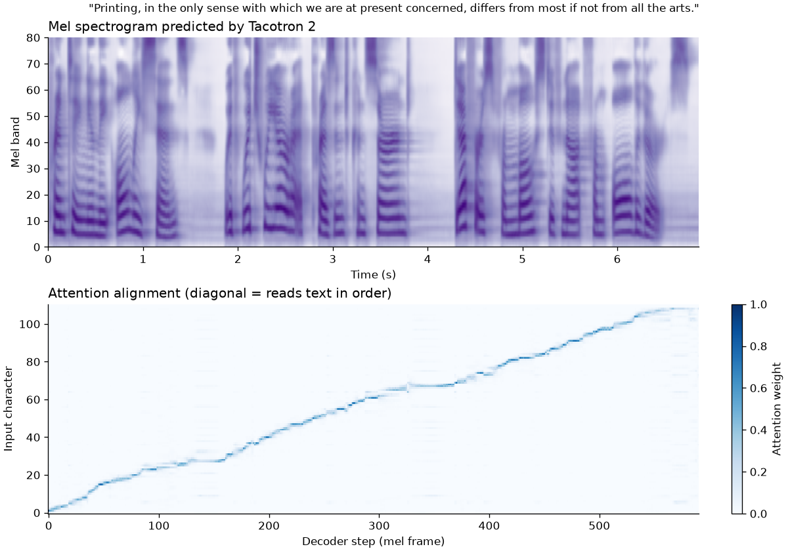
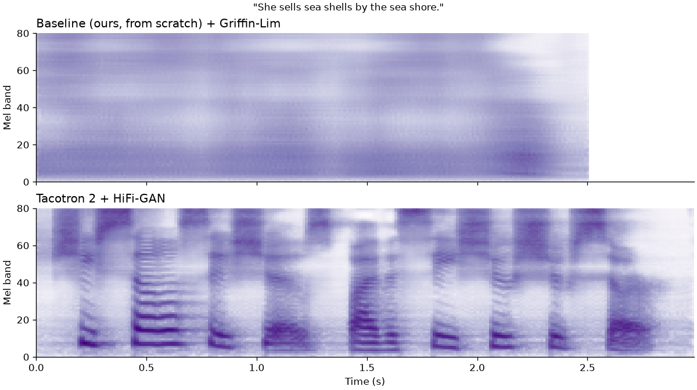

# Colatron: End-to-End Text-to-Speech

UE24CS352A Machine Learning mini-project, PES University (Team 25, Project 20).

**Team:** Mann Mehta (PES2UG24CS266), Marapareddy Deekshitha (PES2UG24CS268)

We revisit the Stanford CS229 (2018) project *"End-to-End Text to Speech Synthesis"*
(Wang, Yang, Li). That project trained SVR, a small neural network, and a seq2seq LSTM
on about 200 LJ Speech sentences and reached a best MOS of 2.5 / 5, with attention that
never aligned (repeated words). We rebuild the pipeline with a fixed text mapping, a
standard mel-spectrogram front end, a pretrained Tacotron 2 acoustic model, and a
choice of vocoders, and compare it against our own from-scratch baseline.

```
text ──► text cleaning + fixed character ids ──► Tacotron 2 ──► 80-band mel ──► vocoder ──► .wav
                                                                              (Griffin-Lim or HiFi-GAN)
```

## What is pretrained and what we wrote

| Component | Source |
|---|---|
| Tacotron 2 acoustic model (text → mel) | **Pretrained**: torchaudio `TACOTRON2_GRIFFINLIM_CHAR_LJSPEECH`, trained on all of LJ Speech |
| HiFi-GAN neural vocoder (mel → waveform) | **Pretrained**: SpeechBrain `speechbrain/tts-hifigan-ljspeech` |
| Griffin-Lim vocoder | **Ours**: inverse mel + Griffin-Lim from torchaudio transforms, no learning |
| Shared audio settings, inference pipeline, CLI | **Ours** |
| Attention alignment plots and alignment statistics | **Ours** |
| Fixed-sentence sample generation (same mel through both vocoders) | **Ours** |
| Gradio demo app | **Ours** |
| Data download, text cleaning, mel extraction, splits | **Ours** |
| Baseline model trained from scratch | **Ours** |
| Evaluation: mel distance, results table | **Ours** |

We did not train or fine-tune Tacotron 2 or HiFi-GAN. Our trained model is the baseline.

## Setup (Fedora / Linux, CPU only)

Requires **Python 3.11** (PyTorch does not yet support 3.14). On Fedora: `sudo dnf install python3.11`.

```bash
git clone git@github.com:Mann0801/colatron-tts.git
cd colatron-tts
python3.11 -m venv .venv
source .venv/bin/activate
pip install -r requirements.txt
```

Pretrained weights download automatically on first run (about 200 MB in total) to
`~/.cache/torch` and `checkpoints/`. Neither is committed to the repo.

## Usage

### Synthesize one sentence

```bash
python src/infer.py --text "Hello, this is our project." --vocoder hifigan --out outputs/hello.wav
python src/infer.py --text "Hello, this is our project." --vocoder griffinlim --out outputs/hello_gl.wav
```

Prints the mel and alignment shapes, the audio length and the generation time.

### Live demo

```bash
python app/app.py
```

Open http://127.0.0.1:7860, type a sentence, pick a vocoder and press **Speak**. The page
plays the audio and shows the predicted mel spectrogram and attention alignment.
Pre-generated audio in `samples/` is a fallback if the live demo cannot run.

### Regenerate the comparison samples

```bash
python src/generate_samples.py
```

Synthesizes the 10 fixed sentences in `samples/sentences.csv`. Each sentence becomes a mel
spectrogram once (fixed seed), and that same mel goes through both vocoders, so the only
difference between `samples/main_griffinlim/NN.wav` and `samples/main_hifigan/NN.wav` is
the vocoder.

### Attention alignment plots

```bash
python src/plot_alignment.py                      # 3 default sentences
python src/plot_alignment.py --text "Your sentence here."
```

Writes plots to `samples/alignments/` and prints three statistics per sentence:
**monotonic** (share of decoder steps that do not move backwards in the text),
**coverage** (share of characters that were ever the main focus) and **focus**
(mean peak attention weight).



### Baseline vs main system

```bash
python src/plot_mel_comparison.py            # sentence 05; --id 02 for another
```

Plots the mel spectrograms of `samples/baseline/NN.wav` and `samples/main_hifigan/NN.wav`
for the same sentence. The baseline is a smooth blur with no syllables, pauses or pitch
harmonics, which is why it sounds like noise.



### Data and preprocessing

Run from the repository root, in this order:

```bash
python -m src.preprocess.download        # downloads LJ Speech (~2.6 GB), keeps ~400 clips in data/raw/
python -m src.preprocess.prepare         # cleans text, computes mels, writes data/processed/ and the split
python -m src.preprocess.sanity_check    # plots one real mel and resynthesises it with Griffin-Lim
```

- `download.py` keeps a deterministic subset (file-name hash), so every machine gets the same
  clips. `--target-clips 500` changes the size, `--archive PATH` reuses a downloaded archive and
  `--delete-archive` removes the 2.6 GB file afterwards.
- `prepare.py` lowercases and expands the text (`text_cleaning.py`: numbers, money, ordinals,
  years, abbreviations), maps it to a **fixed** 37-symbol character vocabulary, computes
  80-band log-mels with the shared settings, and makes an 80 / 10 / 10 train / val / test split.
- `sanity_check.py` writes a mel plot and original vs Griffin-Lim audio to `eval/outputs/sanity/`.

Try the text cleaner on its own: `python src/preprocess/text_cleaning.py`.

### Baseline model

```bash
python -m src.models.baseline train      # trains, saves data/baseline/baseline.pt
python -m src.models.baseline generate   # synthesises samples/sentences.csv into samples/baseline/
```

A deliberately weak text-to-mel model trained from scratch on the subset: character embedding
(128-d), three 1-D convolutions (256 channels, kernel 5), linear interpolation of the character
features to the target number of frames (**no attention**), and an MLP to 80 mel bands. L1 loss
on per-band normalised mels, Adam (lr 1e-3), gradient clipping 1.0, batch 16, 60 epochs, best
validation checkpoint kept. Audio comes from the Griffin-Lim vocoder.

### Evaluation

```bash
python eval/objective.py         # mel distance on 20 test clips
python eval/results_table.py     # writes eval/results/results_table.md
```

- `objective.py` converts each system's audio to a mel, aligns it with the real recording's mel
  using dynamic time warping, and reports mean L1 and RMSE (lower is better). Output goes to
  `eval/results/objective.csv`.
- `results_table.py` turns those numbers into the Markdown table in `eval/results/results_table.md`.

## Audio settings

All parts of the project share `src/audio_config.py`, which matches the pretrained
Tacotron 2 and HiFi-GAN:

| Setting | Value |
|---|---|
| Sample rate | 22,050 Hz |
| FFT size / window / hop | 1024 / 1024 / 256 samples |
| Mel bands | 80, slaney scale and norm, 0 to 8000 Hz |
| Stored as | natural log of magnitude, `log(clamp(mel, 1e-5))` |

## Results

Measured on a 24-core laptop CPU, no GPU.

| Vocoder | Type | Time for 3 to 7 s of audio | Notes |
|---|---|---|---|
| WaveRNN (tried, removed) | autoregressive neural | ~49 s for 3.3 s | too slow for a live demo |
| Griffin-Lim | signal processing | 0.06 to 0.10 s | intelligible, metallic |
| HiFi-GAN | parallel neural (GAN) | 0.43 to 1.04 s | natural; about 7× faster than real time |

Tacotron 2 attention on 3 test sentences: **95 to 97% monotonic**, 84 to 88% character
coverage. A clean diagonal means the model reads the text in order, which the original
project's seq2seq model never achieved.

### Objective mel distance (20 held-out test clips, DTW-aligned, lower is better)

| System | Mel L1 | Mel RMSE |
|---|---|---|
| Baseline (ours, from scratch) + Griffin-Lim | 1.218 | 1.527 |
| Tacotron 2 + HiFi-GAN | 0.889 | 1.192 |

The main system is 27% lower in mel L1. Tacotron 2 was pretrained on all of LJ Speech, so it may
have seen these clips (see Limitations).

## Repository structure

```
src/
  audio_config.py        shared mel settings
  infer.py               CLI: text -> wav
  generate_samples.py    fixed sentences through both vocoders
  plot_alignment.py      mel + attention plots and alignment stats
  plot_mel_comparison.py baseline vs main system mel spectrograms
  models/
    tacotron.py          pretrained Tacotron 2 wrapper
    baseline.py          our baseline, trained from scratch
  vocoder/
    griffinlim.py        Griffin-Lim vocoder
    hifigan.py           pretrained HiFi-GAN wrapper
  preprocess/            download, text cleaning, mel extraction, split, sanity check
app/app.py               Gradio demo
eval/                    mel distance and results table
samples/                 committed demo audio (main_griffinlim/, main_hifigan/, baseline/) and plots
report/                  slides and write-up
data/, checkpoints/, outputs/   gitignored
```

## Who did what

| Member | Parts | Files |
|---|---|---|
| Mann Mehta | Pipeline setup, pretrained model integration, vocoders, alignment analysis, samples, inference CLI, demo, README | `src/models/tacotron.py`, `src/vocoder/`, `src/infer.py`, `src/plot_alignment.py`, `src/plot_mel_comparison.py`, `src/generate_samples.py`, `src/audio_config.py`, `app/`, `README.md` |
| Marapareddy Deekshitha | Data, preprocessing, baseline model, evaluation | `src/preprocess/`, `src/models/baseline.py`, `eval/` |

## Limitations

- Tacotron 2 and HiFi-GAN are pretrained on the full LJ Speech dataset, so LJ Speech
  test sentences may have been seen during their training. Mel-distance scores on those
  clips favour the pretrained system.
- Tacotron 2 keeps dropout on in its prenet at inference, so repeated runs differ slightly.
  `generate_samples.py` fixes a seed for reproducibility.
- Single speaker (LJ Speech), English only.

## References

1. X. Wang, Y. Yang, Y. Li. *End-to-End Text to Speech Synthesis.* CS229 project report, Stanford, 2018.
2. J. Shen et al. *Natural TTS Synthesis by Conditioning WaveNet on Mel Spectrogram Predictions* (Tacotron 2). ICASSP 2018.
3. J. Kong, J. Kim, J. Bae. *HiFi-GAN: Generative Adversarial Networks for Efficient and High Fidelity Speech Synthesis.* NeurIPS 2020.
4. D. Griffin, J. Lim. *Signal Estimation from Modified Short-Time Fourier Transform.* IEEE TASSP, 1984.
5. K. Ito, L. Johnson. *The LJ Speech Dataset.* 2017.
6. Y. Wang et al. *Tacotron: Towards End-to-End Speech Synthesis.* Interspeech 2017.
